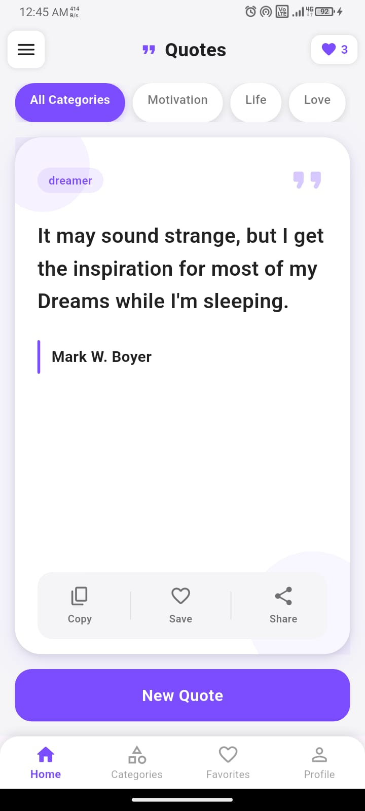
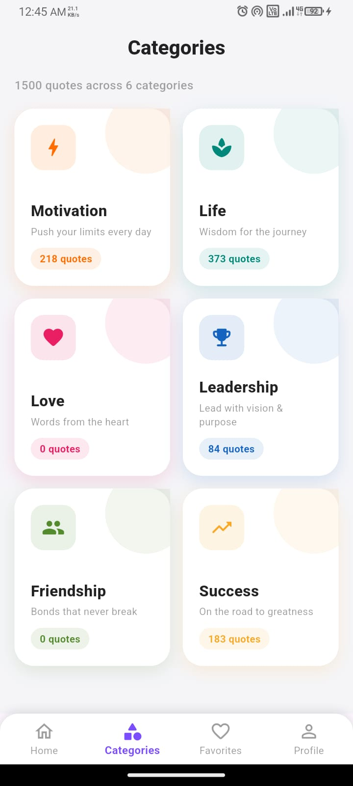
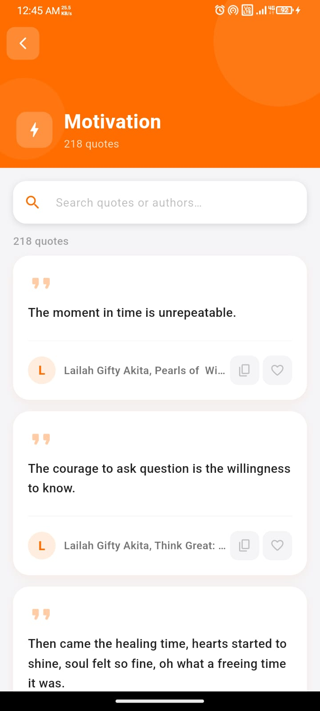
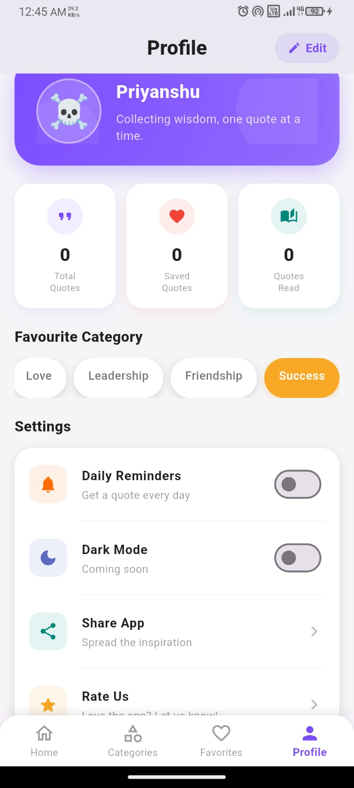

# 📖 Random Quotes App

A modern Flutter application that displays inspirational quotes with a beautiful and intuitive user interface. Users can browse random quotes, filter them by category, save favorites, copy quotes, and manage their profile.

The application uses a **Natural Language Processing (NLP)** processed dataset, where quotes were cleaned, categorized, and filtered before being integrated into the app for accurate category-wise filtering.

---

## ✨ Features

- 🎲 Random Quote Generator
- 📚 Category-wise Quote Filtering
- ❤️ Add & Remove Favorite Quotes
- 📋 Copy Quotes to Clipboard
- 👤 Profile Screen
- 💾 Save Favorites Locally using SharedPreferences
- 🎨 Clean & Modern Material UI
- 📱 Responsive Design
- ⚡ Fast Local JSON Loading

---

## 🧠 NLP Dataset Processing

Instead of using a raw dataset, the quotes were preprocessed using **Natural Language Processing (NLP)** techniques.

### Processing Steps

- Removed duplicate quotes
- Cleaned unwanted symbols and text
- Standardized quote categories
- Organized quotes into meaningful categories
- Converted the processed dataset into a lightweight JSON file

This preprocessing improves category filtering accuracy and overall application performance.

---

## 📸 Screenshots

> Replace these images with your own screenshots after creating the `screenshots` folder.

<p align="center">
  
  
  
  
</p>

---

## 📂 Project Structure

```
random_quotes/
│
├── assets/
│   └── quotes.json
│
├── lib/
│   ├── category_page.dart
│   ├── favorite_page.dart
│   ├── home_page.dart
│   ├── main.dart
│   ├── main_shell.dart
│   ├── profile_page.dart
│   └── quote_model.dart
│
├── screenshots/
│   ├── home.png
│   ├── categories.png
│   ├── favorites.png
│   └── profile.png
│
├── pubspec.yaml
├── README.md
└── LICENSE
```

---

## 📦 Tech Stack

- Flutter
- Dart
- Material Design
- SharedPreferences
- JSON
- Natural Language Processing (NLP)

---

## 📋 Quote JSON Format

```json
{
  "quote": "Success is not final, failure is not fatal.",
  "author": "Winston Churchill",
  "category": "Success"
}
```

---

## 📱 Application Screens

- 🏠 Home Screen
- 📂 Categories Screen
- ❤️ Favorites Screen
- 👤 Profile Screen

---

## 🚀 Getting Started

### 1. Clone the Repository

```bash
git clone https://github.com/priyanshub001/random_quotes.git
```

### 2. Navigate to the Project

```bash
cd random_quotes
```

### 3. Install Dependencies

```bash
flutter pub get
```

### 4. Run the Application

```bash
flutter run
```

---

## 📁 Assets

The application uses a local JSON dataset stored inside:

```
assets/quotes.json
```

The dataset is loaded using Flutter's `rootBundle` and parsed into Dart model objects.

---

## 📱 Supported Platforms

- ✅ Android
- ✅ iOS
- ✅ Web
- ✅ Windows
- ✅ macOS
- ✅ Linux

---

## 🔮 Future Enhancements

- 🌙 Dark Mode
- 🔍 Search Quotes
- 📤 Share Quote as Image
- 🔔 Daily Quote Notifications
- ☁ Firebase Authentication
- ☁ Cloud Sync for Favorites
- 🤖 AI-based Quote Recommendation
- 📊 Quote Analytics
- 🌍 Multi-language Support

---

## 📄 License

This project is licensed under the MIT License.
